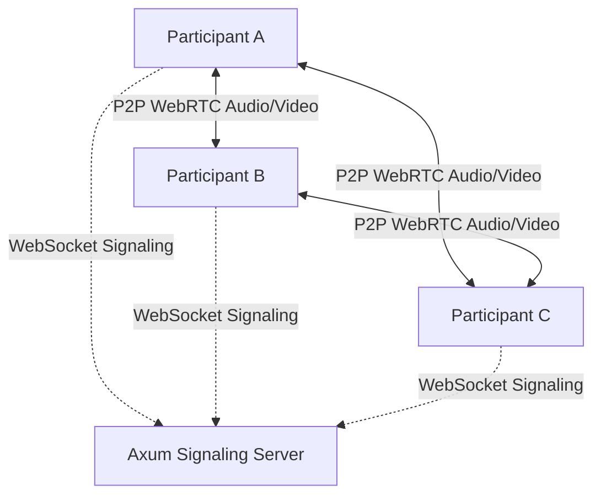

# Converse Meet 📹

Converse Meet is a high-performance, modern, browser-based video conferencing application designed for low-latency P2P collaboration. It is built as a fully self-contained ecosystem, using **Rust (Axum)** for a secure, multi-threaded backend and **Vite React TypeScript** for a premium, glassmorphism-styled frontend.

By utilizing standard web APIs like WebRTC and the Web Audio API, Converse Meet facilitates encrypted peer-to-peer audio, video, screensharing, real-time text chat, hand-raising queues, and interactive presenter reactions—all served from a single compiled binary without external dependencies or cloud media server overhead.

---

## Key Feature Set

1. **🔒 Secure Custom Session Gate**:
   - Built-in user registration and login with secure hashed password storage.
   - Persistent authorization using session tokens that can be securely handled via headers, query params, or cookies.

2. **🔑 Dynamic Meeting Modes**:
   - Instant room generation using the familiar `xxxx-xxxx-xxxx` format code.
   - **Open Meetings**: Anyone with the link or meeting code can join instantly.
   - **Restricted Meetings**: Users are sent to an interactive waiting lobby. Hosts and co-hosts receive visual requests with sound indicators to **Approve** or **Reject** entrants.

3. **📡 P2P Multi-Peer Mesh WebRTC Engine**:
   - Establish direct, low-latency browser connections (`RTCPeerConnection`) with stun servers for peer coordination.
   - Dynamic grid alignment adjusting video tiles fluidly for up to 9 concurrent speakers.
   - Real-time active speaker voice detection with pulsing visual border highlights.

4. **🖥️ Dynamic Screensharing**:
   - Seamlessly switch your camera track to your desktop viewport on the fly using standard browser display APIs.
   - Swaps back to webcams automatically when screen share is ended.

5. **💬 Real-Time Collaboration Toolbar**:
   - Microphone and camera toggles with instantaneous track state synchronization.
   - Hand-raising list toggle, creating a visual speaker queue for hosts.
   - Group Chat side panel with persistent unread badge notifications.
   - Emoji reaction picker that triggers rising emojis floating above video frames.
   - Host Moderator Controls: Force-mute participants, promote to co-host, or kick users from the call.

6. **🎵 Synthesized Chime Alerts**:
   - Utilizes pure browser-level Web Audio API oscillators to generate latency-free notification sweeps for joins, departures, chat notifications, and hand raises. Requires zero bulky audio assets to load or download!

---

## Architectural Topology

Converse Meet uses a **Full-Mesh WebRTC Network Topology**:



- **P2P Mesh vs SFU**: In a mesh topology, each participant sends their media stream directly to every other participant. This provides the **lowest possible latency** since video/audio doesn't go through an intermediate cloud server. It is completely secure, free to operate, and perfectly optimized for collaborative team meetings (typically **4 to 10 parallel speakers**).
- **WebSocket Signaling**: The Rust Axum server acts as a lightning-fast WebRTC signaling bridge, routing SDP offers, answers, ICE candidates, chat broadcasts, and host controls between the participants.

---

## Getting Started

### System Requirements
- [Rust & Cargo](https://rustup.rs/) (Installed)
- [Node.js](https://nodejs.org/) (v18+)

---

## Developer Operations (Hot-Reloading Mode)

To run the client and server separately for development:

### 1. Run the Rust Axum API Server
```bash
cd Converse/backend
cargo run
```
*Backend is listening on `http://localhost:5000`*

### 2. Run the Vite React Frontend
```bash
cd Converse/frontend
npm install
npm run dev
```
*Vite client is running on `http://localhost:5173`. Open in your browser to begin testing!*

---

## Production Deployment (Unified Server Mode)

Converse Meet can compile frontend assets directly, allowing a **single Rust executable to host both the REST API, signaling server, and client files**:

### 1. Build the React Bundle
```bash
cd Converse/frontend
npm run build
```

### 2. Start the Unified Server
```bash
cd Converse/backend
cargo run
```
Once started, visit **`http://localhost:5000`** in your browser! The Axum server will host the full web application, manage cookie sessions, and coordinate WebSocket connections on the same port!
